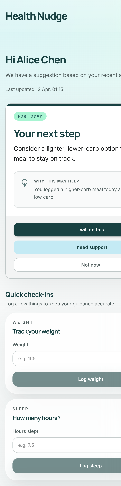
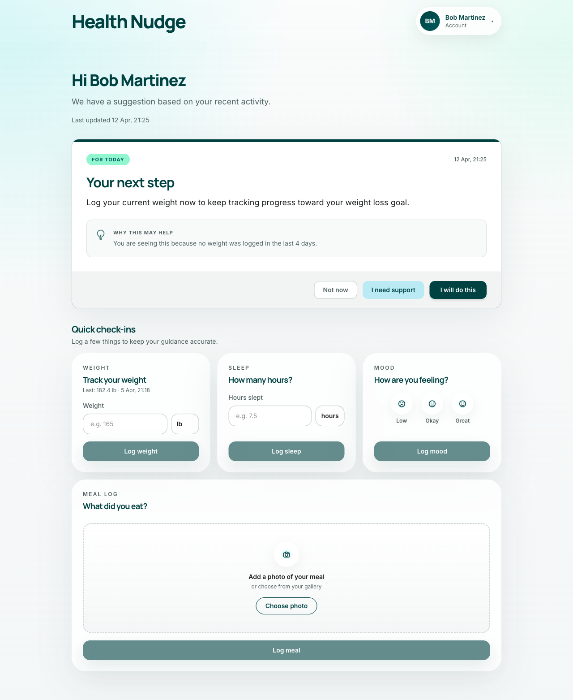
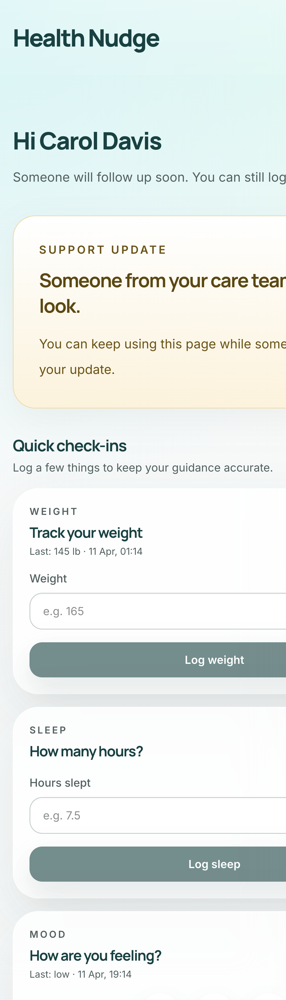
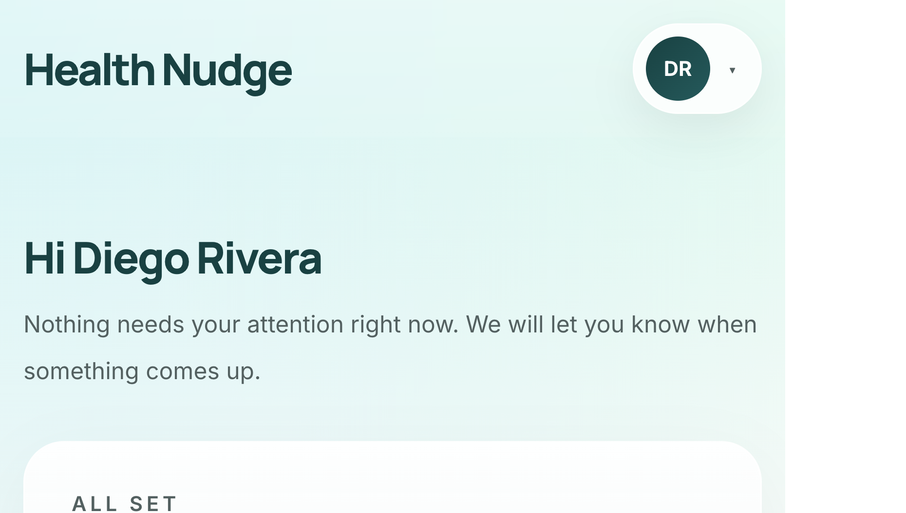
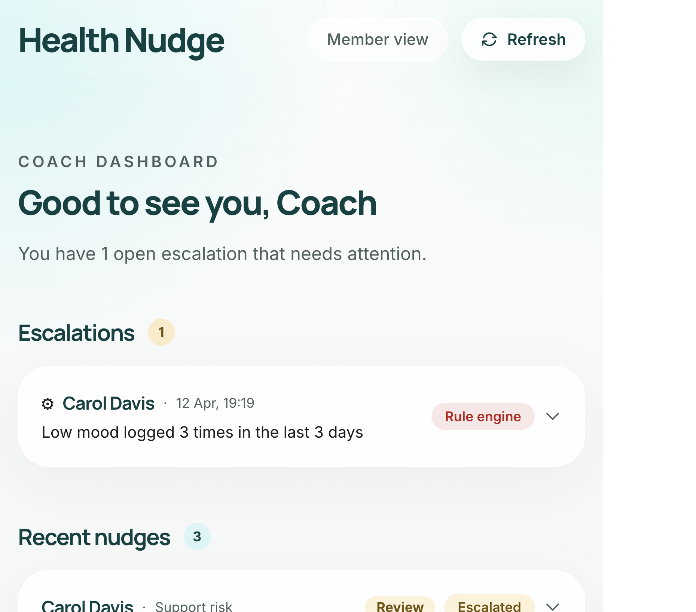
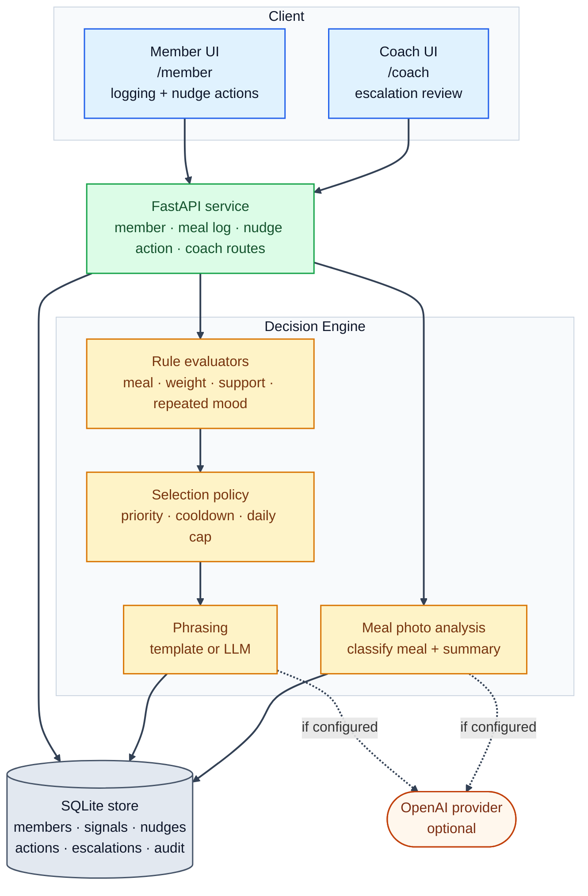

# Context-Aware Health Nudge

A proactive health coaching prototype that delivers personalized nudges, escalates higher-risk moments to a coach, and keeps every decision reviewable.

A **nudge** is a short, contextual message surfaced to a member — for example, a gentle reminder after a higher-carb meal or a prompt to log weight. A **signal** is a self-reported data entry (meal, weight, mood, or sleep) that the member logs through the app. When signals suggest a situation the system shouldn't handle automatically — such as repeated low mood — the engine creates an **escalation**, routing the case to a human coach instead of sending another nudge.

## Quick Start

The project runs locally with or without an `OPENAI_API_KEY`. Without a key, the app falls back to pre-written template text for nudges and a conservative default classification for meal photos — no core features are lost, just the natural-language polish.

Requires `make`, Node.js (≥20), and Python (3.10+).

```bash
# Installs dependencies (Python venv + npm) and seeds the SQLite database
make setup

# Runs the backend test suite with pytest
make test

# Starts frontend (http://localhost:5173) and backend API (http://127.0.0.1:8000)
make dev
```

After `make dev`, open `http://localhost:5173/member` for the member experience and `http://localhost:5173/coach` for the coach review flow. If Vite chooses a different port because `5173` is already in use, use the frontend URL printed in the terminal.

The backend also serves interactive API docs at `http://127.0.0.1:8000/docs` (Swagger UI) for exploring endpoints directly.

### Seeded Demo Scenarios

The database is pre-loaded with four members representing distinct states:

| Member           | Signal                                    | What you'll see                                                           |
| ---------------- | ----------------------------------------- | ------------------------------------------------------------------------- |
| **Alice Chen**   | Logged a pasta-and-bread meal             | Meal guidance nudge — higher-carb meal against her low-carb goal          |
| **Bob Martinez** | No weight log in 7 days (trigger is 4+)   | Weight check-in nudge — reminds him to log weight                         |
| **Carol Davis**  | Logged "low" mood 3 times                 | Support escalation — routed to a coach instead of another automated nudge |
| **Diego Rivera** | Recent weight log, no out-of-range signal | No active nudge — the all-good / no-nudge state                           |

Each nudge carries a **confidence** score (0–1) reflecting how certain the rule engine is that a nudge is appropriate. Scores at or above 0.50 are delivered directly to the member; scores below 0.50 — or cases flagged as safety-sensitive like Carol's — are escalated to a coach for review. Confidence is computed from factors like signal recency, severity, and recent member activity, not from an LLM.

<details>
<summary>Confidence ranges per scenario</summary>

- **Alice:** typically 0.78–0.90, depending on meal recency and classification clarity.
- **Bob:** typically 0.50–0.76, depending on how overdue the weight log is and recent activity on other signals.
- **Carol:** hard-capped below 0.48 — the engine ensures repeated-low-mood nudges always route to a coach.
</details>

Switch between members using the member switcher in the top-right corner of both views.

Logging a meal, weight, or mood entry in the member view immediately re-evaluates the nudge card, so the seeded scenarios can also be exercised live without a page refresh. If that evaluation produces a new nudge, it supersedes the prior one. Sleep entries are persisted in the same flow, but they are not currently used by the decision engine and therefore do not change the nudge outcome.

_(See `.env.example` in `server/` and `client/` for available environment overrides, such as port configurations and timeouts)._

## Screenshots

<table>
<tr>
<td width="50%">

**Alice Chen — meal guidance nudge**

A higher-carb meal against a low-carb goal surfaces an actionable nudge with three response options.



</td>
<td width="50%">

**Bob Martinez — weight check-in nudge**

A missing weight log triggers a gentle reminder to check in.



</td>
</tr>
<tr>
<td>

**Carol Davis — support escalation state**

When the engine crosses the escalation threshold, the member sees a supportive holding state while a coach reviews the case.



</td>
<td>

**Diego Rivera — no active nudge**

When all signals are within normal range, the member sees an "all set" state with quick check-in cards.



</td>
</tr>
<tr>
<td colspan="2">

**Coach dashboard**

The coach view lists open escalations and a full nudge history with status badges so reviewers can see what the system surfaced and how members responded. The statuses are: **Active** (currently displayed to the member), **Escalated** (routed to a coach instead of being delivered), **Acted** (the member tapped an action option), and **Dismissed** (the member chose to skip it).



</td>
</tr>
</table>

## Architecture



The core design principle is **rules first, LLM at the edges**. Decisioning — which nudge to surface, at what confidence, whether to escalate — is handled entirely by deterministic rule evaluators and a priority/fatigue policy (a same-type cooldown of 24 hours plus a daily cap of 2 nudges, with safety escalations exempt from both). This makes every decision auditable and reproducible without a model, and keeps the escalation boundary (a safety concern) outside probabilistic systems. LLM calls are reserved for two bounded, fallback-safe tasks: rewriting pre-approved nudge text into natural language, and classifying a meal photo. Both have template fallbacks and output validation. SQLite was chosen to eliminate infrastructure dependency for a prototype; it can be swapped for PostgreSQL without touching the application layer.

Architecture at a glance:

- **Client** — React 19 + Vite + Tailwind. Two routes: `/member` (nudge card, quick logging) and `/coach` (escalations, recent nudges).
- **API** — FastAPI routers with typed Pydantic request/response models. No business logic lives here.
- **Engine** — Deterministic rule evaluators select a nudge candidate; fatigue policy filters it; optional LLM phrasing rewrites the text (with template fallback). Meal photo analysis is a separate bounded LLM call.
- **Data** — SQLite with 6 tables: `members`, `signals`, `nudges`, `nudge_actions`, `escalations`, `audit_events`. Seeded with 4 assignment scenarios.

### LLM Prompts and Evaluation

Two bounded LLM calls exist in the system. Both use structured outputs with fallback paths, so the system works identically without an API key.

**Nudge phrasing** (`server/app/phrasing/provider.py`)
The model receives a structured payload — nudge type, member goal, matched reason, explanation basis, tone, and character limits — and is instructed to rewrite the approved nudge text without changing the underlying decision, adding new facts, or introducing medical framing. It returns a JSON object with two fields: `content` (member-facing sentence, ≤120 chars) and `explanation` (why the nudge appeared, ≤120 chars). Output is validated against a blocklist of 13 medical/clinical terms (`diagnose`, `medication`, `prescription`, `dose`, `treatment plan`, `doctor`, `clinician`, `therapy`, and others). Any validation failure, timeout, JSON parse error, or missing key falls back to a static template, and `phrasing_source` in the audit log records which path was taken.

**Meal photo classification** (`server/app/meal_analysis/provider.py`)
The model receives only the image — no member context, no written description — and classifies visible food items into one of four profiles: `higher_carb`, `higher_protein`, `balanced`, or `unclear`. It returns a `visible_food_summary` (one factual sentence ≤160 chars describing only visible items, or null). The model is explicitly instructed to return `unclear` when the image is blurry, cropped, or does not support a confident classification. No advice, warnings, or coaching is permitted. The classification is an input signal to the rule engine; the engine makes the final nudge decision.

The current upload path accepts PNG, JPEG, GIF, and WEBP meal photos up to 10 MB. Unsupported formats are rejected before analysis so the member gets a clear retry path instead of a vague fallback.

For the full product rationale, assumptions, success metrics, and rollout plan, see [product-technical-note.md](product-technical-note.md).

## Resetting the Demo

To restore the original seeded state at any point, run:

```bash
curl -X POST http://127.0.0.1:8000/debug/reset-seed
```

This wipes and re-seeds the SQLite database. Requires the backend to be running with `DEBUG=true` set in `server/.env` (already set by `make setup`).

## What I Would Improve With Two More Weeks

With two more weeks, I would spend less time broadening the assignment and more time closing the gap between a strong local prototype and something a care team could pilot with confidence.

- **Authentication, member opt-in, and role-aware access.** The member switcher works for a seeded assignment, but the first real step toward a pilot is replacing it with explicit identity, clear member opt-in to proactive nudges, and clear separation between member and coach access.
- **Coach resolution workflow.** The current escalation path proves the system can flag when automation should stop; the missing half is giving coaches a place to resolve a case, leave notes for follow-up, and close the loop operationally.
- **Delivery beyond the open app.** Right now the value of a nudge depends on the member choosing to reopen the app. Adding push, SMS, or an in-app inbox would make the system more useful at the moment a reminder is needed, not just when the assignment is visited.
- **Production-grade data layer and deployment.** SQLite was the right call for a zero-dependency prototype, but moving to PostgreSQL and containerising the app are the natural next steps before running this in any shared environment.
- **LLM prompt versioning and observability.** The two bounded LLM calls are still manageable in code, but a pilot would benefit from prompt versioning, tracing, and fallback monitoring so phrasing and meal-analysis changes stay reviewable without widening the model's role in decisioning.
- **Configurable rule engine.** Thresholds, cooldowns, and daily caps are currently set in code. Moving them to a tracked config with change history would let program teams adjust the rules and add new cases — such as sleep consistency or positive reinforcement — without a code deploy.

## AI Usage Disclosure

### Tools Used

- **GitHub Copilot (VS Code + Agent)** — Used for implementation scaffolding, iteration, test drafting, documentation drafts, and PR review passes across the project. Models used through these workflows included GPT-5.4, Claude Opus 4.6, and other available Copilot models.
- **Agent Skills, Vercel React and FastAPI** — Used selectively through Copilot as code-quality and best-practice references during implementation.
- **Playwright and Google Chrome DevTools MCP** — Used for manual testing, debugging, and UI iteration throughout development.
- **Google Stitch** — Used for early visual ideation only; the final UI was implemented directly in the codebase.
- **ChatGPT** — Used for early brainstorming on product framing and architecture tradeoffs before implementation.

### What Was Assisted

- Planning documents (`docs/phase-01-*.md` through `docs/phase-09-*.md`, `docs/plan.md`) were drafted or rewritten with AI assistance, then manually reviewed and refined through follow-up prompts.
- Copilot assisted with scaffolding and autocomplete across the FastAPI, Pydantic, React, and Tailwind code; the final implementation was manually reviewed, locally debugged, and refined through additional prompts.
- AI provided substantial assistance with testing, UI design, and documentation; each section was reviewed and iterated upon.
- All pull requests received an additional Copilot Agent review pass before merging to `main`.
