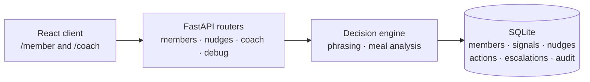

# Context-Aware Health Nudge

A local prototype for rule-based member nudges, coach escalation, and reviewable decisioning.

## Quick Start

The project runs locally with or without an `OPENAI_API_KEY`. Without a key, the app uses template phrasing and conservative meal-analysis fallbacks.

Requires Node.js (≥20) and Python (3.10+).

```bash
# Installs dependencies (Python venv + npm) and seeds the SQLite database
make setup

# Starts frontend (http://localhost:5173) and backend API (http://127.0.0.1:8000)
make dev
```

_(See `.env.example` in `server/` and `client/` for available environment overrides, such as port configurations and timeouts)._

## Architecture



Architecture at a glance:

- **Client** — React 19 + Vite + Tailwind. Two routes: `/member` (nudge card, quick logging) and `/coach` (escalations, recent nudges).
- **API** — FastAPI routers with typed Pydantic request/response models. No business logic lives here.
- **Engine** — Deterministic rule evaluators select a nudge candidate; fatigue policy filters it; optional LLM phrasing rewrites the text (with template fallback). Meal photo analysis is a separate bounded LLM call.
- **Data** — SQLite with 6 tables: `members`, `signals`, `nudges`, `nudge_actions`, `escalations`, `audit_events`. Seeded with 4 demo scenarios.

## Deliverables & Documentation

Reviewer docs:

- **[Product and Technical Note](docs/product-technical-note.md):** User problem, assumptions, success metrics, and rollout plan.
- **[Manual Verification](docs/manual-verification.md):** Walkthrough checklists for testing the seeded scenarios, live inputs, and structural fallbacks.
- **[Decision Record](docs/plan.md):** The as-built system summary, component rationale, and constraints.
- **Implementation Specs:** `docs/phase-01-*.md` through `phase-09-*.md` contain the historical branch-by-branch specifications.

## Demo Reset (Admin Only)

To start fresh during a review session, run the following command while the backend is running (`DEBUG=true` required in `server/.env`):

```bash
curl -X POST http://127.0.0.1:8000/debug/reset-seed
```

This wipes the SQLite database and restores the initial seeded member scenarios, signals, and nudges.

## What I Would Improve With Two More Weeks

- **Authentication and sessions.** Replace the query-parameter member switcher with real identity, consent capture, and role-based access for coaches.
- **Coach resolution workflow.** Let coaches resolve escalations, add notes, and mark follow-ups complete — turning the read-only surface into an operational tool.
- **Push and in-app notifications.** Deliver nudges through a real channel (push, SMS, or in-app inbox) instead of requiring the member to open the app.
- **Configurable rule thresholds.** Expose cooldown windows, daily caps, and evaluator parameters in an admin UI so program managers can tune behaviour without code changes.
- **Analytics dashboard.** Surface the nudge funnel (generated → delivered → acted/dismissed/escalated), LLM fallback rate, and escalation volume as time-series charts for ongoing quality monitoring.
- **PostgreSQL and containerised deployment.** Move from SQLite to a managed relational database and package the app in Docker for reproducible staging and production environments.
- **Richer evaluator library.** Add evaluators for sleep pattern changes, consecutive missed logs, and positive reinforcement nudges — demonstrating the engine's extensibility.

## AI Usage Disclosure

### Tools Used

GitHub Copilot in VS Code was used for drafting and scaffolding.

### Artifacts Assisted

- **Planning documents:** `docs/phase-01` through `docs/phase-09` and `docs/plan.md` were drafted with Copilot and then edited by hand.
- **Scaffolding:** Initial FastAPI, Pydantic, React, and Tailwind scaffolding was drafted with Copilot autocomplete.
- **Tests:** Parts of `test_engine.py` and `test_api.py` were drafted with Copilot and then corrected and extended by hand.
- **Documentation:** README sections, the product note, and the manual verification checklist were drafted with Copilot and then edited for accuracy.

### Decisions Manually Reviewed

- Rule evaluator thresholds (confidence scores, cooldown windows, daily caps) were chosen by hand based on the assignment's example scenarios.
- The escalation boundary (low confidence < 0.50 or `escalation_recommended`) was a deliberate product decision, not an AI suggestion.
- Keeping LLM usage limited to phrasing, never decisioning, was an explicit architecture choice.

### Deterministic Fallbacks and Safety Boundaries

- LLM phrasing is optional: the system works identically with or without an API key.
- All LLM output is validated (character limits, blocked medical terms, JSON schema) before reaching the member. Failures fall back to static templates.
- Audit data records whether phrasing came from `llm` or `template`.
- Support-risk handling stays deterministic and is never LLM-driven.
