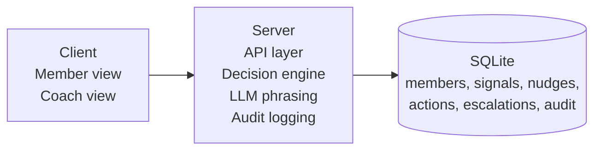

# Final Plan: Context-Aware Health Nudge

## 1. Objective

This project will deliver a focused end-to-end vertical slice. The slice should show a personalized nudge, explain why it appeared, handle confidence explicitly, escalate safely to a coach when needed, expose that activity in a coach view, and keep a clear audit trail. LLM usage stays bounded to copy phrasing and photo-based meal extraction, never as the source of truth for decisioning.

Member profiles and baseline history may be seeded, but the visible nudge flow should still respond to fresh member-entered signals during the demo.

The scope is intentionally narrow. The goal is a coherent product slice built well, not the start of a broad health platform.

## 2. Delivery Structure

Implementation should follow the phase specs in the `docs` folder:

- [phase-01-foundation-and-data.md](./phase-01-foundation-and-data.md)
- [phase-02-decision-engine.md](./phase-02-decision-engine.md)
- [phase-03-api-contracts.md](./phase-03-api-contracts.md)
- [phase-04-member-experience.md](./phase-04-member-experience.md)
- [phase-05-coach-experience.md](./phase-05-coach-experience.md)
- [phase-06-llm-safety-and-phrasing.md](./phase-06-llm-safety-and-phrasing.md)
- [phase-07-observability-and-audit.md](./phase-07-observability-and-audit.md)
- [phase-08-ui-ux-redesign.md](./phase-08-ui-ux-redesign.md)
- [phase-09-quality-demo-and-delivery.md](./phase-09-quality-demo-and-delivery.md)

This document is the high-level decision record. The phase files hold execution detail and branch boundaries.

## 3. Scope Boundaries

The implementation will stay centered on one member-to-coach workflow.

| In scope                                               | Out of scope                          |
| ------------------------------------------------------ | ------------------------------------- |
| One active nudge per member with explanation           | Auth, multi-channel delivery          |
| Lightweight signal logging for meals, weight, and mood | Broad dashboard or profile management |
| Three actions: act now, dismiss, ask for help          | Real health data integrations         |
| Escalation to coach on low confidence or ask-for-help  | Coach assignment workflows            |
| Coach view with recent nudges and open escalations     | Analytics dashboards                  |
| LLM-enhanced phrasing with deterministic fallback      | ML-based confidence scoring           |
| Audit trail for key system events                      | Compliance-grade infra                |
| SQLite, local setup, no Docker                         | Configurable rules UI                 |

## 4. Product Scenarios

The product will support exactly three scenarios.

### Scenario 1: Meal goal mismatch

If a member logs a meal through the member experience and it is inconsistent with their goal, the system suggests a lighter next meal. This is a high-confidence nudge because the rule match is direct and easy to explain.

### Scenario 2: Missed weight logging

If a member has not logged weight for several days, the system sends a gentle reminder to check in. The signal is clear, but the phrasing should stay soft. A fresh weight log should clear the need for another reminder on the next retrieval so the flow feels responsive rather than pre-baked.

### Scenario 3: Support risk

If signals indicate low mood combined with repeated dismissals, or if the member explicitly asks for help, the system escalates the case to a coach. Mood input should stay simple and structured, and the escalation decision should remain rule-based. This is the path where the product should defer to a human rather than continue automated nudging.

## 5. Architecture and Stack

The frontend will use Vite, React, React Router, and Tailwind CSS, with light TypeScript where it improves clarity. A single-page app keeps the interaction model simple and avoids unnecessary SSR complexity.

The backend will use Python, FastAPI, and Pydantic. That stack gives a clean API surface, strong validation, and a straightforward place to attach the phrasing layer.

SQLite is the right persistence choice for this scope because it keeps local setup simple while preserving an explicit relational model.

## 6. Decisioning Model

The decision engine will use three explicit evaluator functions rather than a generic rules framework:

1. `check_meal_goal_mismatch` compares recent meal signals against the member's goal.
2. `check_missing_weight_log` evaluates how long it has been since the last weight signal.
3. `check_support_risk` looks for low mood combined with repeated dismissals or other signs that should move the case to human review.

Selection stays deterministic: evaluate all scenarios, collect matches, apply fatigue and deduplication rules, pick the highest-priority candidate, and then apply the confidence policy.

An existing active nudge is never superseded in this prototype. Reevaluation happens only when there is no active nudge or after the current nudge reaches a terminal state.

### Confidence policy

| Tier   | Range     | Behavior                                                |
| ------ | --------- | ------------------------------------------------------- |
| High   | >= 0.75   | Deliver the nudge immediately                           |
| Medium | 0.50-0.74 | Deliver with softer language and flag in coach view     |
| Low    | < 0.50    | Do not auto-deliver; create escalation for coach review |

### Operating defaults

| Area                        | Default                                                           |
| --------------------------- | ----------------------------------------------------------------- |
| Timestamp standard          | UTC ISO 8601 strings everywhere                                   |
| Duplicate active nudge rule | Never generate a second active nudge while one remains unresolved |
| Cooldown window             | 24 hours for the same `nudge_type` after `act_now` or `dismiss`   |
| Daily cap                   | Maximum 2 auto-delivered nudges per member per UTC day            |
| Support-risk fatigue        | Support-risk escalation bypasses cooldown and daily cap           |
| Candidate priority order    | `support_risk` > `meal_guidance` > `weight_check_in`              |
| Tie-breaker                 | Higher confidence first, then most recent matching signal         |

- High- and medium-confidence nudges are persisted and returned as the active nudge.
- Low-confidence outcomes create an escalation and return no auto-generated nudge.
- The member API should represent this explicitly as `state: "active"`, `state: "no_nudge"`, or `state: "escalated"`.

### Default evaluator thresholds

| Evaluator          | Default trigger                                                                                         | Confidence |
| ------------------ | ------------------------------------------------------------------------------------------------------- | ---------- |
| Meal goal mismatch | Member goal is `low_carb` and a meal in the last 24 hours is classified as `meal_profile = higher_carb` | `0.86`     |
| Missing weight log | No `weight_logged` signal in the last 4 full days                                                       | `0.68`     |
| Support risk       | `mood_logged.mood` is `low` in the last 3 days and there are at least 2 dismissals in the last 7 days   | `0.42`     |

These are prototype defaults, not clinical logic. They exist to keep implementation concrete and reviewable.

## 7. LLM Usage and Guardrails

The LLM is a visible part of the solution, but it stays tightly bounded.

### Separation of concerns

- The rule engine decides whether a nudge should exist, what type it is, how confident the system is, and whether escalation is recommended.
- The phrasing prompt only rewrites already-approved member-visible copy from structured facts.
- The meal-analysis prompt only extracts a cautious structured meal profile from the uploaded image and never decides whether a nudge should exist.

### Graceful degradation

- If `OPENAI_API_KEY` is set, the system can use the LLM for phrasing and meal-photo analysis.
- If the key is missing, or if a provider call fails or times out, phrasing falls back to deterministic templates and meal analysis falls back to a conservative `meal_profile = unclear` result.
- The application must remain fully usable without an API key.

### Guardrails

- Phrasing receives only short structured decision context and is not allowed to add new health claims, diagnosis language, medication guidance, or treatment suggestions.
- Meal analysis receives only the photo input, returns a tightly validated JSON object with `meal_profile` and optional `visible_food_summary`, and must prefer `meal_profile = "unclear"` over unsupported guesses.
- Output length is capped and provider JSON is validated before persistence.
- Every LLM outcome is logged as either `llm_call` or `llm_fallback`, including `prompt_area` and `model_name`.

## 8. Data Model

The schema will use six focused tables:

- `members`: `id`, `name`, `goal_type`, `profile_json`, `created_at`
- `signals`: `id`, `member_id`, `signal_type`, `payload_json`, `created_at`
- `nudges`: `id`, `member_id`, `nudge_type`, `content`, `explanation`, `matched_reason`, `confidence`, `escalation_recommended`, `status`, `generated_by`, `phrasing_source`, `created_at`, `delivered_at`
- `nudge_actions`: `id`, `nudge_id`, `action_type`, `metadata_json`, `created_at`
- `escalations`: `id`, `nudge_id`, `member_id`, `reason`, `source`, `status`, `created_at`, `resolved_at`
- `audit_events`: `id`, `event_type`, `entity_type`, `entity_id`, `payload_json`, `created_at`

Enumerated values:

- `signal_type`: `weight_logged`, `mood_logged`, `sleep_logged`
- `nudge_type`: `meal_guidance`, `weight_check_in`, `support_risk`
- `nudge.status`: `active`, `acted`, `dismissed`, `escalated`
- `nudge_actions.action_type`: `act_now`, `dismiss`, `ask_for_help`
- `escalations.status`: `open`, `resolved`
- `generated_by`: always `rule_engine` in this prototype
- `phrasing_source`: `template`, `llm`

`profile_json` and `payload_json` stay flexible, but timestamps should be UTC and seed data should use stable, deterministic IDs.

## 9. API Surface

The API should stay compact and align directly with the product flow.

| Method | Endpoint                           | Purpose                                  |
| ------ | ---------------------------------- | ---------------------------------------- |
| GET    | `/api/members/{member_id}/nudge`   | Get or generate the active nudge         |
| POST   | `/api/nudges/{nudge_id}/action`    | Record act_now, dismiss, or ask_for_help |
| GET    | `/api/coach/nudges`                | Return recent nudges for coach view      |
| GET    | `/api/coach/escalations`           | Return open escalations queue            |
| POST   | `/api/members/{member_id}/signals` | Live member signal logging               |
| POST   | `/debug/reset-seed`                | Dev-only: reset and reseed the database  |

The `ask_for_help` action automatically creates an escalation so the member path and coach path stay connected.

Default API behavior:

- `GET /api/members/{member_id}/nudge` returns `200` with a structured body for `active`, `no_nudge`, or `escalated` states.
- Coach endpoints default to `limit=20` and cap `limit` at `50`.
- Validation failures return `422`, missing resources return `404`, and invalid state transitions return `409`.

## 10. Product Surfaces

### Member experience

- Provide a compact "log an update" area for weight, mood, and meal entry so the demo includes fresh member interaction.
- Show one active nudge card at a time.
- Include a short explanation such as "Why am I seeing this?" so the recommendation feels grounded in member context.
- Offer exactly three actions: Act now, Dismiss, and Ask for help.
- Meal logging should require photo capture or upload with inline preview, while the backend extracts structured nutrition fields from the image and saves the meal in one step.
- The page should guide members through this photo-based meal logging flow, and detailed meal nudges may use backend-extracted meal fields immediately in this assignment flow.
- Meal photos may stay transient for this assignment build even though they are required for meal logging, but a production product would likely persist uploaded photos so members can review past uploads.

### Coach experience

The coach view should make it easy to see what the system has done and where human intervention is needed.

- The recent nudges feed shows member name, nudge type, content, explanation, confidence, user response, escalation flag, and timestamp.
- The open escalations queue shows member name, reason, source, status, and timestamp.
- Lightweight filters are optional and only worth adding if they are cheap.

## 11. Observability and Seed Data

The system should persist a clear audit trail for the key events in the workflow.

- Persisted audit events include `nudge_generated`, `user_action`, `escalation_created`, `llm_call`, and `llm_fallback`.
- LLM audit rows should capture `prompt_area` and `model_name`, and `nudge_generated` should carry `llm_model_name` when phrasing was upgraded by the LLM.
- Structured backend logs should capture member ID, nudge ID, confidence, matched reason, escalation decision, and whether final phrasing came from a template or the LLM.

The seed dataset should give a reviewer believable starting context while still leaving the visible product interactions to live signal capture where possible:

- One member with low-carb goal context for the meal-guidance path
- One member for the missed weight logging case
- One member for the support-risk or escalation case with enough prior history to exercise coach review
- At least one previously acted nudge and one previously dismissed nudge

## 12. Quality and Delivery

Testing should focus on the parts of the system that most directly affect trust.

### Backend tests

1. Meal mismatch produces the correct nudge candidate.
2. Missing weight log produces the correct reminder.
3. Support risk follows the low-confidence escalation path.
4. No matching signals produces no nudge.
5. Ask-for-help creates an escalation.
6. Active nudge retrieval is idempotent.
7. LLM failure falls back to templates correctly.

### Manual verification

Walk all three scenarios end to end through both the member view and the coach view, including at least one fresh signal submission for weight, mood, or meal logging.

### Implementation order

| Phase                | Steps                                                                      |
| -------------------- | -------------------------------------------------------------------------- |
| **Foundation**       | Repo structure, SQLite schema, seed data                                   |
| **Decisioning**      | Evaluator functions, confidence policy, fatigue controls, nudge generation |
| **LLM layer**        | LLM phrasing service, fallback, guardrails, audit logging                  |
| **Member flow**      | Member page, action handling, frontend-to-backend wiring                   |
| **Coach flow**       | Recent nudges view, escalation queue                                       |
| **UI/UX redesign**   | Shared frontend foundation, member experience polish, coach review polish  |
| **Quality and docs** | Focused tests, README, product and technical note                          |

### Documentation deliverables

- `README.md` should include setup instructions, a simple architecture diagram, an explanation of the approach, a two-week improvement plan, and an AI usage disclosure.
- The product and technical note should cover the user problem, assumptions, success metrics, major risks, and rollout plan, and it should describe the system that was actually built.

## 13. Intentional Exclusions

This plan intentionally excludes production auth, Docker, PostgreSQL, configurable rules UI, analytics dashboards, multi-channel delivery, coach workload management, real health data, ML confidence models, and compliance-grade infrastructure.

That tradeoff is deliberate. A strong submission here is a coherent and defensible vertical slice, not a broad but incomplete platform sketch.
