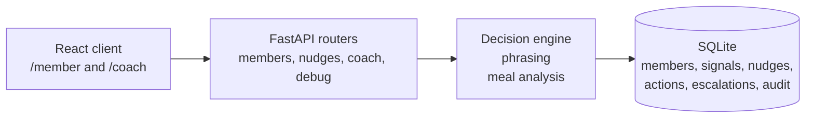

# Context-Aware Health Nudge

This document captures the implementation in the repo as of 2026-04-05. The phase files in `docs/` remain the branch specs; this file records the as-built system.

## 1. Current Objective

The project delivers a focused member-to-coach vertical slice:

- a deterministic rule engine decides whether a nudge should exist
- the member route shows one current state at a time: `active`, `no_nudge`, or `escalated`
- the coach route exposes recent nudges and open escalations for review
- LLM usage is optional and limited to phrasing and meal-photo analysis
- audit logging captures the key system events needed for review

Scope stays narrow: one member-to-coach workflow.

## 2. Current Status

| Area                          | Current state                                                                                            |
| ----------------------------- | -------------------------------------------------------------------------------------------------------- |
| Backend vertical slice        | Implemented in FastAPI with SQLite persistence and seeded demo scenarios                                 |
| Deterministic decision engine | Implemented with three evaluators, fatigue rules, idempotent reads, and supersede-on-new-signal behavior |
| Member experience             | Implemented at `/member` with member switching, nudge actions, and live quick logging                    |
| Coach experience              | Implemented at `/coach` with open escalations and expandable recent-nudge review                         |
| Optional AI usage             | Implemented for bounded nudge phrasing and photo-only meal analysis, with deterministic fallbacks        |
| Observability                 | Implemented with audit events and structured logging hooks                                               |
| Backend verification          | Implemented and currently passing via `server/test_engine.py` and `server/test_api.py`                   |

## 3. Scope Boundaries

The implementation stays centered on one member-to-coach workflow.

| In scope                                   | Out of scope                                      |
| ------------------------------------------ | ------------------------------------------------- |
| One active member state at a time          | Auth and user accounts                            |
| Deterministic nudges plus coach escalation | Notifications or multi-channel delivery           |
| Structured weight, mood, and sleep logging | Broader profile management                        |
| Photo-only one-step meal logging           | Longitudinal food history and photo galleries     |
| Read-only coach review surface             | Coach assignment and operations tooling           |
| SQLite local persistence                   | Production infrastructure and compliance controls |
| Optional bounded LLM integrations          | LLM-driven decisioning or medical reasoning       |

## 4. Seeded Demo Scenarios

The repo currently supports four seeded member states that make the demo reviewable without auth.

| Member              | Purpose                    | Expected state                         |
| ------------------- | -------------------------- | -------------------------------------- |
| `member_meal_01`    | Meal guidance path         | `active` meal-guidance nudge           |
| `member_weight_01`  | Missed weight logging path | `active` weight check-in nudge         |
| `member_support_01` | Support-risk path          | `escalated` with open coach escalation |
| `member_catchup_01` | Control / catch-up case    | `no_nudge`                             |

Member switching is handled in the client so a reviewer can move across these scenarios directly.

## 5. Architecture and Stack

Current stack:

- Client: Vite, React 19, React Router 7, TypeScript, Tailwind CSS 4
- Server: Python, FastAPI, Pydantic
- Persistence: SQLite
- Backend layout: `app.api`, `app.engine`, `app.phrasing`, `app.meal_analysis`, `app.persistence`, `app.observability`

The app is a local-first prototype with a thin app assembly layer and explicit package boundaries.

## 6. Decisioning Model

The current engine uses three explicit evaluators.

| Evaluator                  | Trigger                                                                                                                  | Confidence | Outcome                        |
| -------------------------- | ------------------------------------------------------------------------------------------------------------------------ | ---------- | ------------------------------ |
| `check_meal_goal_mismatch` | Member goal is `low_carb` and the most recent `meal_logged` signal in the last 24 hours has `meal_profile = higher_carb` | `0.86`     | Active `meal_guidance` nudge   |
| `check_missing_weight_log` | No `weight_logged` signal in the last 4 days                                                                             | `0.68`     | Active `weight_check_in` nudge |
| `check_support_risk`       | Most recent mood in the last 3 days is `low` and there have been at least 2 dismissals in the last 7 days                | `0.42`     | Escalated `support_risk` path  |

Operating rules:

| Area                    | Current behavior                                                                                          |
| ----------------------- | --------------------------------------------------------------------------------------------------------- |
| Candidate priority      | `support_risk` > `meal_guidance` > `weight_check_in`                                                      |
| Cooldown                | 24 hours for the same `nudge_type` after `act_now` or `dismiss`                                           |
| Daily cap               | Maximum 2 auto-delivered nudges per member per UTC day                                                    |
| Support-risk fatigue    | Support-risk bypasses cooldown and daily cap                                                              |
| Repeated reads          | Repeated `GET /nudge` returns the same active nudge while no newer signal exists                          |
| Fresh signal behavior   | If a newer signal exists, the prior active nudge is marked `superseded` and the member is re-evaluated    |
| Low-confidence behavior | Low-confidence or escalation-recommended candidates create an escalated nudge row plus an open escalation |

This supersede-on-new-signal behavior is the main functional difference from the earlier draft plan, which assumed an active nudge would never be replaced.

## 7. LLM Usage and Safety Boundaries

OpenAI is optional and used in two places.

### Phrasing

- Applied only to newly created member-visible active nudges
- Decision ownership remains deterministic in the rule engine
- Prompt input is bounded to structured facts: `nudge_type`, `member_goal`, `matched_reason`, `explanation_basis`, tone, and character limits
- Output must validate as one JSON object with `content` and `explanation`
- Each field is capped at 160 characters and checked against blocked medical terms
- Any missing key, timeout, provider error, invalid JSON, or validation failure falls back to deterministic templates

### Meal analysis

- The member meal flow is photo-only on the client path
- The provider receives the meal photo plus narrow instructions and returns structured JSON only
- Expected output is `meal_profile` plus optional `visible_food_summary`
- `meal_profile` is constrained to `higher_carb`, `higher_protein`, `balanced`, or `unclear`
- Fallback behavior remains non-blocking and persists a conservative structured result

### Safety posture

- The LLM is never the source of truth for decisioning
- Support-risk stays deterministic and coach-facing
- Meal photos are transient analysis inputs in this prototype
- Audit logging distinguishes successful calls from fallbacks and records `prompt_area` plus `model_name`

## 8. Data Model

The live schema uses six main tables.

| Table           | Purpose                                                           |
| --------------- | ----------------------------------------------------------------- |
| `members`       | Seeded member records and goal context                            |
| `signals`       | Structured member inputs and meal-analysis results                |
| `nudges`        | Persisted nudges, confidence, status, phrasing source, timestamps |
| `nudge_actions` | Member actions: `act_now`, `dismiss`, `ask_for_help`              |
| `escalations`   | Open or resolved coach-review records                             |
| `audit_events`  | Durable review trail for key system events                        |

Current enumerated values of note:

- `signal_type`: `meal_logged`, `weight_logged`, `mood_logged`, `sleep_logged`
- `nudge_type`: `meal_guidance`, `weight_check_in`, `support_risk`
- `nudges.status`: `active`, `acted`, `dismissed`, `escalated`, `superseded`
- `escalations.source`: `rule_engine`, `member_action`
- `phrasing_source`: `template`, `llm`

The schema also includes indexes for frequent query paths across signals, nudges, actions, escalations, and audit events.

## 9. API Surface

API surface:

| Method | Endpoint                             | Purpose                                                  |
| ------ | ------------------------------------ | -------------------------------------------------------- |
| GET    | `/health`                            | Simple health check                                      |
| GET    | `/api/members/{member_id}/nudge`     | Return the current member state or generate it           |
| POST   | `/api/members/{member_id}/signals`   | Persist structured weight, mood, or sleep signals        |
| POST   | `/api/members/{member_id}/meal-logs` | Persist a photo-only meal log via one-step meal analysis |
| POST   | `/api/nudges/{nudge_id}/action`      | Record `act_now`, `dismiss`, or `ask_for_help`           |
| GET    | `/api/coach/nudges`                  | Return recent nudges for coach review                    |
| GET    | `/api/coach/escalations`             | Return open escalations                                  |
| POST   | `/debug/reset-seed`                  | Reset and reseed the database in debug mode              |

Current API behavior:

- `GET /api/members/{member_id}/nudge` returns explicit `active`, `no_nudge`, or `escalated` states
- `POST /api/nudges/{nudge_id}/action` returns `409` for terminal-state nudges
- `ask_for_help` automatically creates an escalation
- Coach endpoints default to `limit=20` and cap `limit` at `50`
- Validation failures return `422` and missing resources return `404`
- The meal-log endpoint rejects unexpected multipart fields such as `description`

## 10. Product Surfaces

### Member route

The member route at `/member` includes:

- seeded member switching by query parameter
- an active nudge card with explanation and exactly three actions
- explicit empty and escalated states
- quick-log forms for weight, sleep, and mood
- photo-only meal upload with inline preview and validation feedback
- silent nudge refresh after successful logging

### Coach route

The coach route at `/coach` includes:

- open escalations with member name, reason, source, status, and timestamp
- recent nudges with confidence, status, and latest member action
- expandable nudge rows that expose full content, explanation, matched reason, phrasing source, and meal context when available
- a lightweight refresh action
- a read-only posture with no coach-side mutation tools

## 11. Observability and Verification

Durable audit events:

- `nudge_generated`
- `user_action`
- `escalation_created`
- `llm_call`
- `llm_fallback`

Verification assets:

- `server/test_engine.py` covers evaluator logic, priority, cooldown, daily cap, superseding, escalation behavior, and phrasing fallback rules
- `server/test_api.py` covers member endpoints, coach endpoints, action handling, meal-photo flow, validation behavior, audit recording, and LLM fallback behavior

Verification status:

- `server/test_engine.py`: passing locally
- `server/test_api.py`: passing locally

Supporting delivery docs present in the repo:

- `README.md`
- `docs/product-technical-note.md`
- `docs/manual-verification.md`

## 12. Known Deltas and Follow-On Work

Two deltas are worth keeping explicit.

1. The current coach header includes a direct link to `/member`, which differs from the stricter route-isolation goal described in the UI redesign phase.
2. The high-level draft plan originally omitted the dedicated `/api/members/{member_id}/meal-logs` endpoint and the `meal_logged` / `sleep_logged` signal footprint; this document now treats those as part of the implemented contract.

## 13. Intentional Exclusions

This prototype still intentionally excludes production auth, Docker, PostgreSQL, notifications, analytics dashboards, configurable rules UI, coach workload management, external health integrations, and compliance-grade infrastructure.

Those are reasonable tradeoffs for a local prototype.
